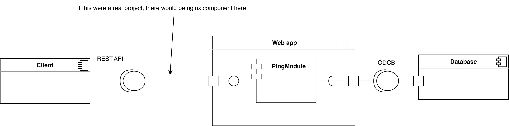

## Description

Docker container exposes web app on port 3000.
To test out handler you should send POST request to `/v1/pings` with body { bodyNumber: `number` }.
Other handlers are not implemented.


## components UML diagram

## sequence UML diagram

## Installation

```bash
$ npm install
```

## Running the app

```bash
# development
$ npm run dev

# watch mode
$ npm run watch

# production mode
$ npm run prod
```

or using docker

```bash
$ docker compose up
```

## License

[Nest](https://github.com/nestjs/nest) is [MIT licensed](LICENSE) and so do this project
